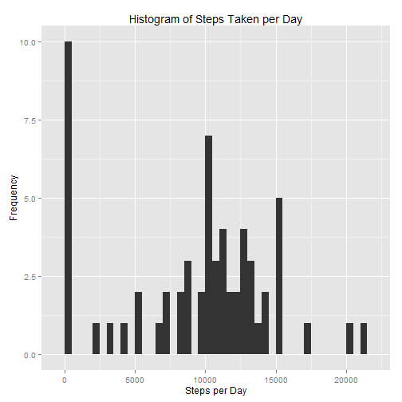
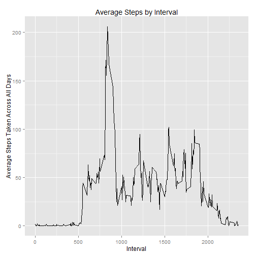
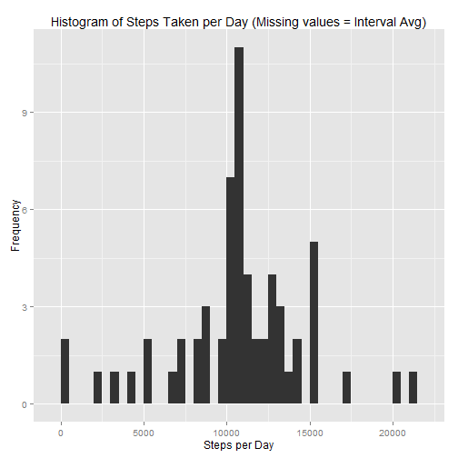
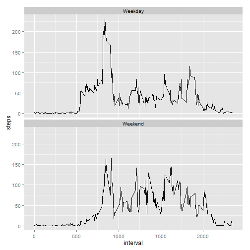

***
***
###Load needed Libraries


```r
## Load Libraries
library(ggplot2)
library(lubridate)
library(dplyr,warn.conflicts=FALSE)
```

***
***
###Load and preprocess the Activity dataset
***

```r
ActivityData <- read.csv("C:/2015 R Folder/RepData_PeerAssessment1/repdata-data-activity/activity.csv")
#date into dateformat:
ActivityData$date <- ymd(ActivityData$date)
```

***
***
### What is the distribution of steps taken per day?
***

```r
#1) Calculate the total number of steps taken per day 
StepsByDate <- aggregate(ActivityData$steps, by = list(ActivityData$date), FUN=sum, na.rm=TRUE)
colnames(StepsByDate) <- c("date", "steps")

#2) Create a histogram of the total number of steps taken each day.
ggplot(data=StepsByDate, aes(x=steps)) + geom_histogram(binwidth = 500) +
  labs(title="Histogram of Steps Taken per Day", x = "Steps per Day", y = "Frequency")  
```

 

```r
#3) Determine the mean and media for the data set  
```

The mean is 9354 and median is 10395

***
***
### What is the average daily activity pattern?
***

```r
#1) Calculate Average Steps by Interval
AverageStepsByInterval <- aggregate(ActivityData$steps, by=list(ActivityData$interval), FUN=mean, na.rm=TRUE)
colnames(AverageStepsByInterval) <- c("Interval", "AvgSteps")

#2) Create plot of the 5-min interval (x-axis) and the average steps taken, averaged across all days (y-axis)
ggplot(AverageStepsByInterval, aes(x=Interval, y=AvgSteps)) + 
geom_line() + labs(title="Average Steps by Interval", x="Interval", y="Average Steps Taken Across All Days")
```

 

```r
#3) What is the interval with the maximum number of steps?
AverageStepsByInterval[which.max(AverageStepsByInterval$AvgSteps),]
```

```
##     Interval AvgSteps
## 104      835 206.1698
```

***
***
### What is the effect of Missing values?
The strategy for missing step values is to replace the missing step values with average steps for that interval


```r
#1) Determine the number of missing Step values in the dataset
sum(is.na(ActivityData$steps))
```

```
## [1] 2304
```

```r
#2) Create an index of missing values. 
IndexWithNas <- which(is.na(ActivityData$steps))

#3) Create a new dataset, equal to the original dataset
ActivityDataWithImputtedValues <- ActivityData

#4) Use the already created dataset for Average Steps by Interval to replace missing values in the new data set
for (i in 1:NROW(IndexWithNas)) {
      IntervalNeeded <- ActivityDataWithImputtedValues$interval[IndexWithNas[i]]
      AvgStepsForInterval <- AverageStepsByInterval$AvgSteps[AverageStepsByInterval$Interval ==
                               IntervalNeeded]
      ActivityDataWithImputtedValues$steps[IndexWithNas[i]] <- AvgStepsForInterval
      }

#5) Confirm missing Step values have been replaced
sum(is.na(ActivityDataWithImputtedValues$steps))
```

```
## [1] 0
```

```r
#6) Calculate average steps for new dataset by date for comparison with original histogram
StepsByDateFilled <- aggregate(ActivityDataWithImputtedValues$steps, by=list(ActivityDataWithImputtedValues$date),FUN=sum, na.rm=TRUE)
colnames(StepsByDateFilled) <- c("date", "steps")

#7) Create histogram with missing data filled
ggplot(StepsByDateFilled, aes(x=steps)) +
      geom_histogram(binwidth= 500) +
      labs(title="Histogram of Steps Taken per Day (Missing values = Interval Avg)", 
           x = "Steps per Day", y = "Frequency") 
```

 

```r
#8) Determine the new mean and median using the filled data
```
The new mean with imputed data for steps is 10766 and median is 10766
compared to the original mean 9354 and median 10395 of the original data set.

The impact of imputing the missing values with interval averages is to change the median by 15% and the median by 4%

***
***
###Are there Weekend vs Weekday differences?
***


```r
#1) Create new data set with the type of weekday added
ActivityDataWithImputtedValues$Weekday <- ifelse(weekdays(as.Date(ActivityDataWithImputtedValues$date)) %in% c("Saturday","Sunday"), "Weekend","Weekday")

#2) Confirm that the distribution of weekday and weekend data looks reasonable
table(ActivityDataWithImputtedValues$Weekday)
```

```
## 
## Weekday Weekend 
##   12960    4608
```

```r
#3) Create the avg steps for weekday-type and interval
ActivityDataWithImputtedValuesWeekend <- aggregate(ActivityDataWithImputtedValues$steps, by=list(ActivityDataWithImputtedValues$Weekday, ActivityDataWithImputtedValues$interval), FUN=mean, na.rm=TRUE)

colnames(ActivityDataWithImputtedValuesWeekend) <- c("WeekdayType", "interval", "steps")

#4) Create a time series plot of the 5-minute intervals and the average number of steps taken, 
#   for Weekends and Weekday facets 
ggplot(ActivityDataWithImputtedValuesWeekend, aes(x=interval, y=steps)) +
      facet_wrap(~ WeekdayType, nrow=2, ncol=1) + 
      geom_line()
```

 

Further statistical analysis is needed to confirm Weekday vs Weekend impact but, based on visual review of the two plots, it appears slightly more steps on average are taken on weekends compared to week days and that the average steps are more uniformly distributed during the Weekend day. This could be result of more available non-work hours during a weekend.
